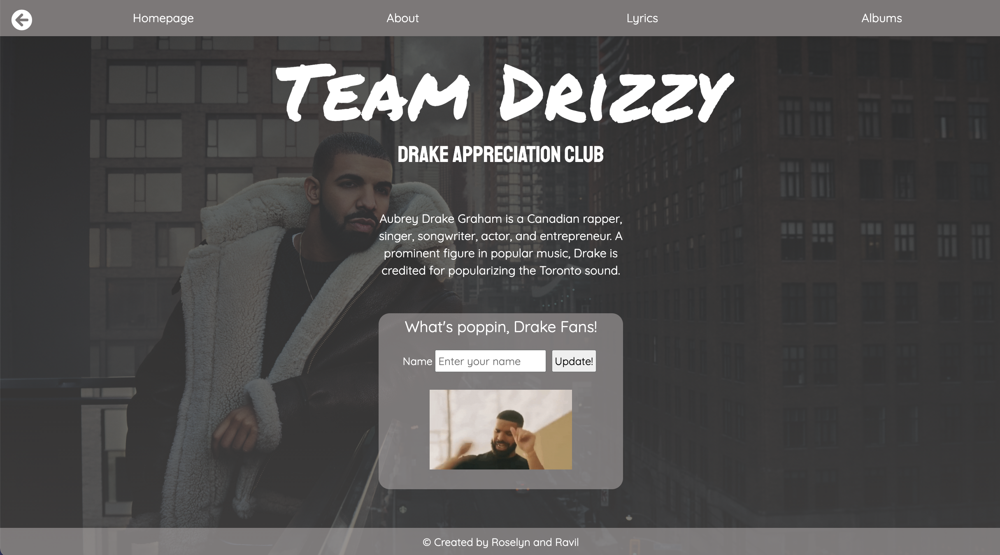

# React - Music App
[](https://app.netlify.com/sites/team-drizzy/deploys)



A music webpage dedicated to Drake for the Team Drizzy fans out there. This project was created by [@roselynle](https://github.com/roselynle) and [@ravil-96](https://github.com/ravil-96) as our first attempt to create a React app from scratch.

### Installation

-   Clone or download this repo

### Usage

-   Navigate to the root directory of this repository
-   Run `npm run dev` which should start up the webpage on localhost:8080/ 

## Technologies

-   React, Webpack, Babel. See below for dependencies:

    ```"-": "0.0.1",
    "@babel/core": "^7.13.15",
    "@babel/plugin-transform-runtime": "^7.13.15",
    "@babel/preset-env": "^7.13.15",
    "@babel/preset-react": "^7.13.13",
    "@testing-library/jest-dom": "^5.11.10",
    "@testing-library/react": "^11.2.6",
    "@testing-library/user-event": "^13.1.2",
    "babel-jest": "^26.6.3",
    "babel-loader": "^8.2.2",
    "css-loader": "^5.2.1",
    "D": "^1.0.0",
    "html-webpack-plugin": "^5.3.1",
    "jest": "^26.6.3",
    "style-loader": "^2.0.0",
    "webpack": "^5.31.2",
    "webpack-cli": "^4.6.0",
    "webpack-dev-server": "^3.11.2"
    }
    "dependencies": {
    "axios": "^0.21.1",
    "react": "^17.0.2",
    "react-dom": "^17.0.2",
    "react-router-dom": "^5.2.0"
    }

## Tasks

-   [x] Set up React App using npm and Webpack
-   [x] Install the required libraries
-   [x] Create a minimum of two components
-   [x] Add a 'Like' feature by implementing useState to track if it has been liked or not
-   [x] Add a controlled form
-   [x] Refactor file structure and use props where appropriate
-   [x] Implement useEffect by fetching data from an API
-   [x] Implement navigation to give the page at least 3 routes
-   [x] Create a 'Back' button using useHistory hook
-   [ ] Set an interval for something to happen
-   [ ] Add nested routing (e.g. for lyrics page)
-   [ ] Write tests as appropriate

## Wins & Challenges

### Wins
-   Created a webpage that utilises the core concepts of React such as components, state, props, hooks, JSX
-   Managed to write tests and get them to pass

### Challenges
-   Understanding how props work and the best way to utilise them in our webpage
-   Slight difficulties with styling (e.g. isolating styling to one page)

## Bugs

-   Webpage is not fully responsive
-   Clicking the button in the lyrics page opens up all the lyrics rather than one container
